# Quant Remora — sistem mimarisi

**Güncelleme: 19 Eylül 2026.** Güncel model sözleşmeleri [CURRENT_MODELS.md](docs/CURRENT_MODELS.md) içinde; aşağıdaki yeni mimari bölümü, devamındaki tarihsel V2 açıklamalarından ayrıdır. Güncel uygulama ve test kodları depoya dahildir; anahtarlar ve yerel durum dosyaları hariçtir.

## Güncel ADA 15m veri ve emir yolu

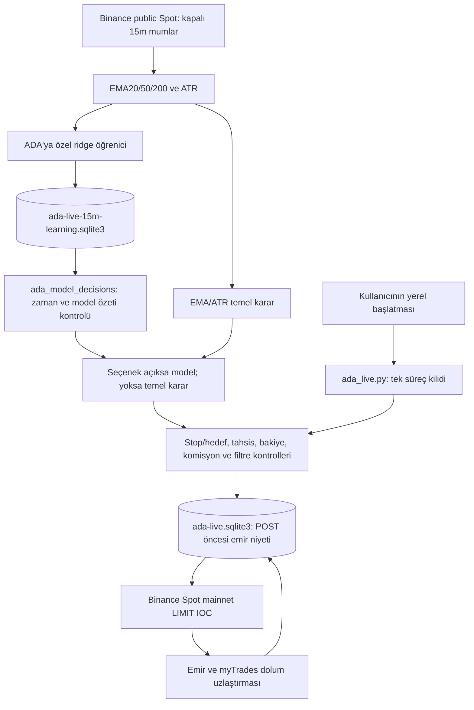

- Testnet ve paper istemcileri/defterleri ADA mainnet yürütme yolundan ayrıdır.
- Anahtarlar kullanıcı başlatıcısının süreç ortamında; durum çıktısı anahtar içermez.
- 15m geçişi aynı kilit altında yapılır. Pozisyon, maliyet referansı, emir geçmişi ve mevcut stop/hedef korunur; eski durum `interval_changes` içinde saklanır.
- `pending` emir yeniden POST edilmez. Durumu sorgulanıp dolumlar uzlaştırılır; belirsiz veya tutarsız durumda yürütme durur.
- 4h ve 15m eğitim ayrı SQLite dosyalarında tutulur. Ortak öğrenici ADA için özel modül örneğiyle yüklenir; BTC/paper global ayarları değiştirilmez.
- Model ve tahmin kayıtları borsa zamanı + monoton geçen süre üzerinden sıralanır. Eğitim bitişi ≤ tahmin oluşturma ≤ karar kontrolü; model etiket sonu karar mumunun kapanışını aşamaz.
- Yerel kilit iki ayrı bilgisayarı koordine etmez. Aynı tahsisi yöneten ikinci canlı kopya çalıştırılmamalıdır.

## Karar ve öğrenme gözlenebilirliği

`model_decisions_enabled` açılış seçeneğini, `latest_candle_decision.owner` son yeni mumun gerçek karar kaynağını belirtir. `decision` ve `learning.decision_authority` mevcut kontrol döngüsüne aittir; yeni mum olmayan döngüde `false`/`ema_atr` görülmesi seçeneğin kapandığı anlamına gelmez. `halted`, `pending`, `last_poll`, `filled_orders` ayrıca izlenir.

## Tarihsel mimari ve araştırma kayıtları

Aşağıdaki bölümler kendi tarihindeki paper/Testnet bileşenlerini anlatır. “Gerçek emir yok”, “aktif V2” ve “otomatik yetki yok” ifadeleri tüm projeyi değil, ilgili eski hattı tanımlar.

## 19 Eylül: 4h hızlı challenger eğitimi

`trend4h_paper.run` → kapalı Binance Spot mumları → `trend4h_learning.update`.
Örnekler timestamp ile tekilleştirilir. Ardışık sonraki mum kapanmadan etiket
üretilmez. Ridge regresyonu 200 etiketle başlayabilir; her yeni etiket sonrası
yenilenir. Geçmiş bootstrap ilk beklemeyi kaldırır. Model sürümleri, standartlaştırma
parametreleri, kontrol metrikleri ve önceden yapılmış tahminler ayrı SQLite
dosyasında saklanır. Eğitim hatası açık paper pozisyonunun yönetimini engellemez.
Bu bir araştırma challenger'ıdır; otomatik strateji aktivasyonu yoktur.

## 18 Eylül: çevrimdışı koşul öğrenme deneyi

`regime_research.py` → `strategy_research.py` simülatörü → zaman damgalı araştırma raporu.
İlk %60 veride koşul istatistikleri ve oynaklık medyanı öğrenilir; sözleşme,
kaynak SHA256 ve dondurulan filtre dosyası kaydedilir. Sonraki %20'de filtre
yeniden eğitilmeden temel stratejiyle ve %0 nakit referansıyla karşılaştırılır.
Geçerse son dönem ve Binance spot kontrolü açılır. Başarı bile otomatik emir
yetkisi vermez; yeni ileri kanıt gerekir. Modül worker durumuna veya aktif
politikaya yazmaz. Son deney başarısızdır ve filtre etkinleştirilmemiştir.

**Belge tarihi:** 14 Eylül 2026

Bu belge aktif `bollinger_15m_v2` politikasının bileşenlerini, veri akışını, model
sözleşmesini ve sanal sermaye sınırlarını açıklar. Proje kararları [MASTER.md](MASTER.md),
komutlar [README.md](README.md), model ailesi benchmarkı
[reports/bollinger-v2-model-family-benchmark.md](reports/bollinger-v2-model-family-benchmark.md)
içindedir.

## Sistem sınırı

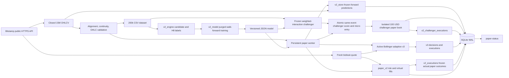

Bitstamp'a yalnız herkese açık `GET` istekleri gider. Kodda kimlik doğrulamalı emir
ucu yoktur. Diyagramdaki pozisyon, alım ve satım nesneleri SQLite içindeki yerel
simülasyondur.

## Katmanlar

| Katman | Dosya | Sorumluluk |
|---|---|---|
| Veri ve CLI | `agent.py` | Bitstamp OHLC sayfalama, veri doğrulama, CSV ve komut yönlendirme |
| Aday/etiket çekirdeği | `v2_engine.py` | Nedensel göstergeler, iki Bollinger adayı, maliyet, H8/H16 triple barrier |
| Meta-model | `v2_model.py` | 17 özellik, purged zaman testi, lojistik eğitim, JSON çıkarım ve terfi kapısı |
| Model benchmarkı | `v2_model_benchmark.py` | Yedi aileyi aynı nested zaman ve maliyet kapısında araştırma amaçlı karşılaştırma |
| İleri challenger | `v2_challengers.py` | Dondurulmuş logistic, aynı-olay skorları, ayrık 100 USD mikro hesap ve aday kapısı |
| İleri gözlem | `v2_store.py` | Kararı dondurma, H8 etiketi oynatma, gerçek paper execution ve challenger tablo şemaları |
| V2 sanal sermaye | `paper_v2.py` | Defter işaretleme, stop/hedef, mikro/normal boyutlama, maliyet ve kesiciler |
| Quant Remora sinyal | `remora_signal.py` | 1H trend, 15m StochRSI, rejim, volatilite, VWAP ve açıklanabilir gate bağlamı |
| Eğitilebilir Remora paper | `paper_v3.py` | Sınırlı mikro sanal sermaye, sonuç etiketi, model kapısı ve zarar korumaları |
| Süreç | `paper.py` | 30 saniyelik worker, kilit, başlangıç/duruş, ortak status, legacy uyumluluk |
| Binance veri/yürütme adapterı | `binance_execution.py` | Public Spot GET-only mumlar ile ayrı Testnet-only HMAC/emir/dolum istemcileri |
| Testnet policy trainer | `testnet_policy_trainer.py` | Ön-kayıtlı momentum eşiklerini iki piyasada maliyet ve dönem kapılarıyla değerlendirip Testnet-only config üretme |
| Binance Testnet worker | `binance_testnet_worker.py` | Ayrı günlük sinyal, 10 USDT pozisyon, SQLite niyet defteri ve süreç kontrolü |
| Testnet online learner | `testnet_online_learner.py` | Sabit eşik ızgarası, maliyetli getiri ölçümü ve yalnız incelemeye açık challenger raporu |
| Testnet öğrenme deposu | `testnet_learning_store.py` | Tek kaynak defterden değişmez etiket/tur aktarımı, karantina, fit takvimi ve sürüm bağlı durum |
| Güvenli Testnet başlatma | `scripts/start-binance-testnet-agent.ps1` | Gizli anahtar girişi, ön kontrol, açık onay ve detached worker ortamı |
| Testnet epoch reseti | `scripts/reset-binance-testnet-agent.ps1` | Durdurulmuş dönemi aynı SQLite içinde arşivleyip temiz aktif epoch açma |
| Kalıcılık | `state/paper.sqlite3` | Durum, olay, portföy ve ileri öğrenme kayıtları |

V1 modülleri `strategies.py`, `experiment.py` ve `learning.py` geçmişi yeniden
üretmek için tutulur; v2 normal sermaye karar yoluna bağlı değildir.

## Veri sözleşmesi

Her mum şu alanları taşır:

```text
ts, open, high, low, close, volume, exchange, symbol
```

Değişmezler:

- `ts` UTC Unix milisaniyesidir ve 900.000 ms'ye hizalıdır;
- ardışık mum farkı tam 900.000 ms'dir;
- fiyatlar pozitif ve sonlu, hacim sonlu ve negatif değildir;
- `low <= min(open, close) <= max(open, close) <= high`;
- `exchange=bitstamp`, `symbol=BTC/USD` olmalıdır;
- indirme sonunda son satır, çağrı başında beklenen son kapanmış mumdur.

İndirici `/api/v2/ohlc/btcusd/` ucunu `step=900`, en fazla 1.000 satırlık sayfalar,
`end` ve `exclude_current_candle=true` ile çağırır. 100–200.000 mum desteklenir.

Quote doğrulaması `0 < bid <= ask`, en fazla 120 saniye yaş ve sınırlı gelecek saat
sapması ister. Yeni giriş için ayrıca son mumun kapanışı 120 saniyeden eski olmamalı ve
hacmi pozitif olmalıdır.

## Nedensel aday yolu

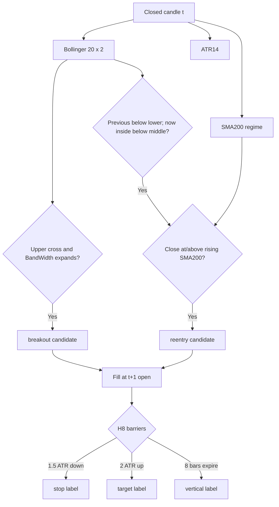

`candidate_signals` karar indeksinden sonrasını görmez. Gelecek satırlar çağıran
tarafça yanlışlıkla verilse bile model özellik fonksiyonu `rows[:decision_index+1]`
önekini alır. Paper worker'ında ilk görülen kapanış yalnız ankraj olur; ancak sonraki
taze kapanış aday üretebilir.

Etiket ufku dolum mumunu sayar. H8 en fazla sekiz tam 15 dakikalık mum, yani iki
saattir. H16 aynı tanımın dört saatlik stresidir. Stop ve hedef aynı mumda görünürse
OHLC içi sıra bilinmediği için stop kazanır. Mum bariyerin ötesinde açılırsa gözlenen
mum açılışı kullanılır.

## Maliyet sözleşmesi

`CostModel` varsayılanı:

```text
fee_each_side      = 0.001   # %0,10
slippage_each_side = 0.0005  # %0,05
spread             = 0
```

Nominal toplam 30 bp ücret+kayma varsayımıdır. Eğitim ayrıca 40 ve 60 bp stres
senaryolarını hesaplar. Paper yürütmesi gerçek zamanlı ask/bid taraflarını referans
alır; girişte göreli spread `<=0,001` olmalıdır.

Model ve paper giriş yolu aynı yürütme sözleşmesini taşır:

```text
execution_policy_version = paper-entry-v1:cost=cost-v1:fee=0.001:slip=0.0005:spread=0:max-spread=0.001:min-target-net=0.003
```

Bu kimlik ücret/kayma sürümünü, %0,10 azami spreadi ve %0,30 asgari maliyet sonrası
hedef alanını birlikte sabitler. Artefakt başka bir yürütme politikasıyla üretildiyse
yükleme doğrulaması başarısız olur ve normal sermaye açılamaz.

Her aday `spec_id`, `policy`, `cost_version`, veri/stream kimliği ve sinyal sürümüyle
etiketlenir. Farklı H, maliyet veya sinyal tanımları aynı eğitim kanıtı gibi
birleştirilemez.

## Model hattı

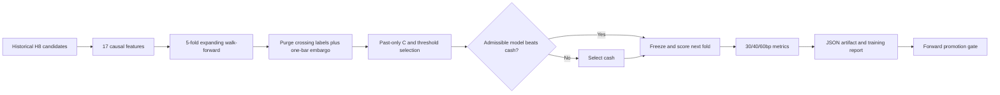

Özellik şeması `causal-features-v1`, model türü
`bollinger_15m_v2_logistic_meta_filter`'dır. İlk 208 mumdan önce SMA200 eğimi
oluşmadığı için bu adaylar model eğitimine alınmaz.

Her fold içindeki `C ∈ {0,05; 0,2; 1,0}` ve eşik
`{0,50; 0,55; 0,60; 0,65; 0,70; 0,75}` yalnız önceki iç doğrulamada seçilir. Nakit
adayının skoru sıfırdır. Aday kabul şartlarını karşılamaz veya nakitten iyi değilse
`cash_selected=true` olur.

Aktif eğitim ayrımı şu sürümlü sözleşmedir:

```text
training_protocol_version = purged-expanding-v2:inner-embargo=1bar:outer-embargo=1bar
```

Kaydedilen JSON, paper çıkarımı için şunları taşır:

- politika, model ve özellik şeması;
- özellik adlarının sabit sırası;
- eğitim veri karması ve etiket/maliyet kimliği;
- paper giriş maliyeti/spread politikasının sürümü;
- iç ve dış birer mumluk embargo eğitim protokolünün sürümü;
- standardizasyon ortalama ve ölçekleri;
- katsayılar ve intercept;
- karar eşiği, nakit seçimi, model sürüm karması;
- promotion sonucu ve `eligible` bayrağı.

Güncel model sürümü
`b2c29f3f5e86bae5bc25d5c196a97935702d8a5fa2f7d3c6ba3d62558381c921`'dir;
`cash_selected=true`, `status=shadow` ve `eligible=false` taşır.

Aktif 200.000 mum/6.192 olay eğitiminde beş dış foldün tamamı nakdi seçmiş, 30/40/60
bp senaryolarında dış işlem üretmemiştir. Ayrıca L2 logistic, Random Forest, Extra
Trees, HistGradientBoosting, getiri-ağırlıklı etkileşimli logistic, Ridge beklenen
getiri ve Huber gradient-return aileleri aynı nested protokolde karşılaştırılmış;
hiçbiri tarihsel istikrar kapısını geçmediği için champion seçilmemiştir. Önceki
120.000 mumda 30 bp'de görülen `+%0,796104`, daha uzun veri ve birer mumluk embargo
altında tekrarlanmadığından emekli edilmiş geliştirme kanıtıdır.

Yükleme sırasında boyut, sonluluk, şema ve sürüm doğrulanır. Bozuk veya uyumsuz model
yüklenemez. Tahminin model sürümü etkin artefaktın sürümüyle eşleşmelidir; aksi halde
worker normal veya mikro sermaye açmaz.

## Ayrık mikro sanal hesaplı challenger hattı

Tarihsel benchmark hiçbir aileyi champion seçmedi. Bu sonuç değişmeden,
`weighted_interaction_logistic` ailesi yalnız yeni veride eşleşmiş karşılaştırma yapmak
üzere sabit bir challenger kohortu olarak kaydedildi:

```text
artifact_status         = frozen_shadow
evaluation_status       = collecting
model_version           = c06bb0e0b4166cf41af892a1a6b7bb77cb038418a13c54809a7d2fc95ad3e6d4
cohort_id               = wil-v1:383b213a060268f1:b2c29f3f5e86bae5
control_model_version   = b2c29f3f5e86bae5bc25d5c196a97935702d8a5fa2f7d3c6ba3d62558381c921
training_events         = 6192
training_cutoff_label_ts= 1789373700000
threshold               = 0.50
```

Kesim `2026-09-14 08:15 UTC`'dir. Kohort kimliği veri OHLCV digest'inin ve kontrol
sürümünün öneklerini içerir. `train-bollinger-v2-challenger`, kontrol sürümünü kesimde
dondurabilmek için worker çalışırken reddedilir.

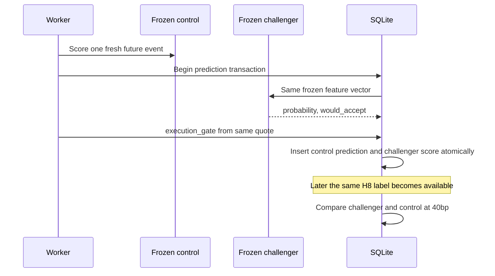

Challenger score satırı `would_accept`, `execution_gate`, bunların birleşimi
`accepted`, özellik sürümü ve özellik digest'ini taşır. Eşleşen challenger artefaktı
bozuksa hook kontrol prediction'ı ve cursor güncellemesini de geri alır; tek taraflı
gözlem bırakmaz.

Challenger'ın ana 1.000 USD sermaye bağlantısı kapalıdır: `capital_enabled=false` ve
her değerlendirmede `capital_mutation=false` kalır. Buna karşılık her model için ana
muhasebeye dahil edilmeyen 100 USD'lik ayrık sanal hesap oluşturulur. `accepted=true`
olan skor, aynı transaction içinde bu hesapta en fazla %10 tahsis ve %0,20 riskle tek
giriş açabilir. Stop, hedef veya H8 süresiyle kapanış; fiyat, miktar, ücret, kayma ve
P&L ile `v2_challenger_executions` tablosuna yazılır. Günlük %2 ve toplam %8 zarar
frenleri uygulanır. Üretim `v2_executions` ve `eligible` değişmeden kalır.

## Eğitilebilir Quant Remora mikro sanal işlem hattı

`quant_remora_v5_trainable_paper_v2` en az 1.000 kapanmış 15m mumdan tamamlanmış
1H EMA20/50/200 bağlamını kurar. 15m StochRSI yalnız tetiktir; trend, rejim,
volatilite, seans VWAP, veri kalitesi, spread, maliyet ve risk kapıları birlikte
geçmeden giriş olmaz. Her mumun `buy`, `sell`, `hold` veya `blocked` sonucu,
`context_json` bileşenleri ve `feature_json` model girdileri saklanır.

Başlangıç eğitimi son 60.000 mumdan zaman boyunca dağıtılmış 200 tarihsel H8 örneği
üretir; `historical_remora_h8_v2` kaynak adı bu geliştirme satırlarının ileri
sayaçlara girmesini engeller. Legacy `historical_remora_h8` satırları backward
compatibility ve eğitim için ayrı saklanır. Canlı kararda her kapanmış 15m mum için
tam bir nedensel probe önceden kaydedilir. Yön önceliği `%20/%80` StochRSI geçişi,
`%30/%70` geniş geçiş ve
son olarak yalnız kapanmış mumların StochRSI yönüdür; eşitlikte kapanmış mum fiyat
yönü kullanılır. Aynı karar mumunda en fazla bir probe yazılır. H8 sonucu sekiz mum
sonra, en geç iki saatte 1 USD nominal için ücret ve kayma dahil hesaplanarak
`v3_probe_executions` tablosuna `paper_remora_probe_h8_v2` kaynağıyla kapanır. Legacy
`paper_remora_probe_h8` örnekleri backward compatibility ve eğitim için ayrı korunur.

Worker yeniden başladığında erişilebilir geçmiş mumları kronolojik evidence-only
backfill eder. Bu satırların tamamı karar zamanından sonra yeniden kurulduğu için H8
sonucu henüz tamamlanmamış olsa bile pre-registered `executed_forward` sayacını
artırmaz. Backfill yalnız eğitim ve veri boşluğu kurtarma içindir. Yeni forward probe
sayılan tek kayıt, worker'ın canlı gözlediği en yeni fresh close için karar anında
yazdığı kayıttır.

Ham etiket akışının üst sınırı 96/gündür. Örtüşen H8 satırları eğitimde kullanılabilir;
model schema 5 ise terfi ve validation kanıtını bütün zaman çizelgesi üzerinde global
olarak çakışmayan `effective` alt kümeyle ölçer. Sekiz mumluk ufuk nedeniyle bağımsız
kanıt üst sınırı yaklaşık 12/gün, 60 effective ileri probe için teorik alt sınır
yaklaşık beş gündür. Kalite kapıları daha uzun veri isteyebilir veya adayı reddedebilir.
En yeni 30 effective gerçekleşmiş ileri probe rolling holdout olarak ayrılır; daha
eski ileri sonuçlar eğitim kümesine geçer. Terfi için aynı kalite sözleşmesinin bu
yalnız-ileri holdout üzerinde de geçmesi gerekir.
Sermaye karantinası, risk sınırları ve gerçek emir yetkisi değişmez; gerçek Binance
short emri veya kaldıraç açılmaz. Bu hat ayrı günlük Binance Testnet öğrenicisinin
defterini, politikasını veya açık pozisyonunu değiştirmez.

Binance public veri katmanı çalışan worker'dan ayrıdır. `binance_archive.py`, Spot
REST veya checksum doğrulamalı Spot/USD-M aylık arşivini iç 15m CSV sözleşmesine
çevirir. Offline eğitim geçici, bellek içi SQLite kullanır; canlı `paper.db` dosyasına
yazmaz. Spot ve USD-M mumları yalnız eşit kapanış zamanlarında birleştirilir ve üç
nedensel basis özelliği eklenir. Üretilen artifact `deployed=false` olarak kaydedilir;
kontrol modelini ancak aynı kronolojik validation ve maliyet kapılarını geçerse
değiştirebilir.

`binance_derivatives.py` checksum doğrulamalı günlük 5m metrics ve aylık funding
arşivlerini yönetir. OI değişimi, genel/top-trader oranları, taker akışı, funding
z-score ve üç rejim özelliğini karar zamanında bilinen son gözlemle birleştirir.
Kontrol ve beş ablation varyantı aynı olaylarla çalışır. Ayrı çıkış araştırması
geliştirme, seçim ve dokunulmamış holdout arasına 32 mum embargo koyar; araştırma
artifact'leri hiçbir koşulda canlı `paper.db` dosyasına yazılmaz.

`long_horizon.py`, kesintisiz Binance USD-M 15m verisini tam 4H mumlara dönüştürür
ve 298 EMA, zaman serisi momentum ve Donchian varyantını stresli maliyetle tarar.
Geliştirme ve seçim kapıları geçilmeden holdout açılmaz; yalnız seçilmiş adayın
holdout sonucu raporlanır. Çıktı her koşulda `deployed=false` ve
`real_orders_enabled=false` taşır.

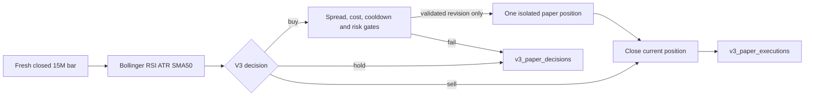

V3 hesabı 100 USD ile başlar ve ana 1.000 USD toplamına katılmaz. Revizyonun
planlanan stop riski %0,15, tahsis tavanı %12, stop 1,5 ATR, hedef 3,2 ATR ve azami
süre dört mumdur. Günlük %2 ve toplam %8 kesici uygulanır. 200.000 mumluk
kronolojik maliyet testi negatiftir; kullanıcı bu bulgudan sonra yalnız ileri sanal
mikro risk için açık yetki verdi. Fail-closed toplama döneminden sonra kullanıcı
15 Eylül'de sanal bakiye riskinin artırılmasını istedi;
29 ileri probe'un PF değeri `0,101` kaldığı için 16 Eylül'de
`ENTRY_QUARANTINED=true` ve `CAPITAL_REQUIRES_ELIGIBLE_MODEL=true` yapıldı. Eski 15m
long ailesi artık sermaye işlemi açmaz. H8 probe hattı bağımsız çalışır ve maliyet
dahil ileri öğrenme örnekleri üretir. Gerçek emir yolu yoktur.

`low_frequency.py`, beş yıllık Binance USD-M günlük mumlarında 281 düşük frekanslı
long/cash kuralını seçer ve seçilen tek kuralı Bitstamp günlük verisinde sabit çapraz
kontrolden geçirir. Üretilen artifact tüm tarih görüldüğü için yalnız forward shadow
adayıdır; `deployed=false`, `capital_enabled=false` ve `real_orders_enabled=false`.
Worker, artifact bulunduğunda `low_frequency_shadow_state`,
`low_frequency_shadow_decisions` ve `low_frequency_shadow_executions` tablolarıyla
yalnız aktivasyondan sonraki tam UTC günlük kapanışları izler. İlk yüklemede geçmiş
günlere forward sonucu yazmaz.

`binance_execution.py` yalnız Spot Testnet taban URL'sini kabul eden fail-closed emir
adapterıdır. İmzalı istekler HMAC-SHA256, 5 saniye `recvWindow`, ortam değişkeninden
kimlik bilgisi ve açıkça verilen `newClientOrderId` kullanır. İmzalama saati public
`/v3/time` örneğinden alınır ve yalnız process belleğindeki monotonic bir ankora
bağlanır; örnek beş dakikada eskir, yavaş veya bozuk örnek imzalı çağrıdan önce
reddedilir. Eşzamanlı yenilemeler generation ile tekilleştirilir. Yapılandırılmış
`-1021` alan imzalı GET, yeni timestamp ve imzayla yalnız bir kez denenir; ikinci
red transport kesintisi sayılır. POST hiçbir zaman otomatik yinelenmez. Public doctor
`exchangeInfo` filtrelerini doğrular; özel yollar hesap, açık emir, `/order/test`,
istemci kimliğiyle emir sorgusu, `myTrades` dolum uzlaştırması ve 5–25 USDT ile
sınırlı market alış/satış sağlar. Gerçek Binance URL'si kod tarafından
reddedilir. POST sonucu belirsizse adapter otomatik tekrar göndermez.

`binance_testnet_worker.py`, paper motorundan ayrı ve politika/model sürümünü adında
taşıyan `state/binance-testnet-<policy>-<model>.sqlite3` defteri kullanır. Hesap
düzeyindeki tek sabit kontrol mutex'i start/stop/reset/eğitim geçişlerini seri hale
getirir; çalışan süreç ayrıca politika sürümlerinin paylaşmak zorunda olduğu tek
hesap yürütme lease'ini ömrü boyunca tutar. Bu yürütme pilotu eğitilmiş 15 dakikalık
Bollinger modeli değildir. Negatif ileri sonucu olan V3'ten emir almaz. Sabitlenmiş
düşük frekans Testnet adayını kullanır: Binance public Spot'tan gelen tamamlanmış UTC
günlük mumda 30 günlük getiri `>%10` ise long, aksi halde nakit. Public veri
istemcisi yalnız izinli `/api/v3/klines` GET yolunu açar; kimlik bilgisi, hesap veya
emir metodu yoktur. Yalnız hedef durum değiştiğinde 10 USDT
Testnet pozisyonu açar veya yalnız kendi dolumlarıyla edindiği BTC'yi satar.

`testnet_policy_trainer.py` `%0/%3/%5/%10` adaylarını `%0,20` tek-yön maliyet,
iki piyasa, 4/5 pozitif dönem, PF, düşüş ve aktivite kapılarıyla değerlendirir. Bu
veride yalnız `%10` geçti. Eğitimdeki uzun Binance serisi USD-M, yürütme ise Spot
olduğu için son bir yıllık Binance Spot serisi ayrıca tanı olarak kaydedilir; sonucu
`-%10,44` ve PF `0,678` olduğundan artifact yalnız Testnet exploration statüsündedir.
Gerçek para, paper terfisi ve canlı emir bayrakları kapalıdır.

Emir niyeti POST'tan önce SQLite'a yazılır. İstemci kimliği politika, kapanmış
mum zamanı ve yönden deterministik üretilir. Kesinti sonrası aynı POST tekrarlanmaz;
`GET /order` ve gerektiğinde `GET /myTrades` ile dolum yeniden kurulur. Bilinmeyen
açık emir, kimlik/sembol/yön uyuşmazlığı, yetersiz bakiye, dust veya Testnet'in
aylık sıfırlamasına işaret eden kayıp kaynak emir yeni emri kapatır. Başlatma için
iki ayrı anahtar gerekir: `BINANCE_TESTNET_WORKER_ENABLED=true` ve
`BINANCE_ORDER_EXECUTION_ENABLED=testnet`. Kimlik bilgileri güvenli başlatma
PowerShell işlemi ile onun ön kontrol çocuklarında geçici olarak bulunur; sonunda
temizlenir. Başarılı başlangıçtan sonra yalnız detached worker kendi kopyasını tutar.
Yürütme defteri ilk kesin uzlaştırmada Testnet API anahtarının SHA-256 parmak izine
bağlanır. Ham anahtar veya secret saklanmaz, parmak izi durum çıktısına verilmez.
Sonraki start, çalışma ve reset aynı API anahtarı bağını kanıtlamadan defteri kullanamaz.
Eski sürümün salt okunur imzalı çağrıda kaydettiği kesin `-1021` haltı yalnız kontrol
mutex'i ve hesap lease'i altında kurtarılır. Aynı hesap, sıfır açık emir ve varsa
yerel dolu BUY kaydı uzak Binance emriyle birebir doğrulanmadan halt temizlenmez;
pozisyon, emir niyeti, karar ve öğrenme kanıtına dokunulmaz.

Testnet'in dönemsel hesap sıfırlamasından sonra reset yalnız worker durmuşken,
bekleyen niyet ve BTCUSDT açık emri yokken çalışır. Yerel pozisyon açıksa kaynak BUY
emrinin imzalı `GET /v3/order` sorgusunda yapılandırılmış `-2013` ile silindiği kesin
olarak kanıtlanmalıdır; transport veya genel istemci hatası kanıt değildir. Ayrı reset
kapısı ve açık onay gerekir. Worker durumu, kararlar ve emir niyetleri aynı SQLite transaction'ında
append-only epoch tablolarına arşivlenir; kontrol mutex'i eşzamanlı start/stop/reset
yarışını engeller. Son işlenmiş mum sınırı yeni epoch'a taşınır; aynı günlük mumda
istemci kimliği yeniden kullanılarak ikinci emir açılamaz.

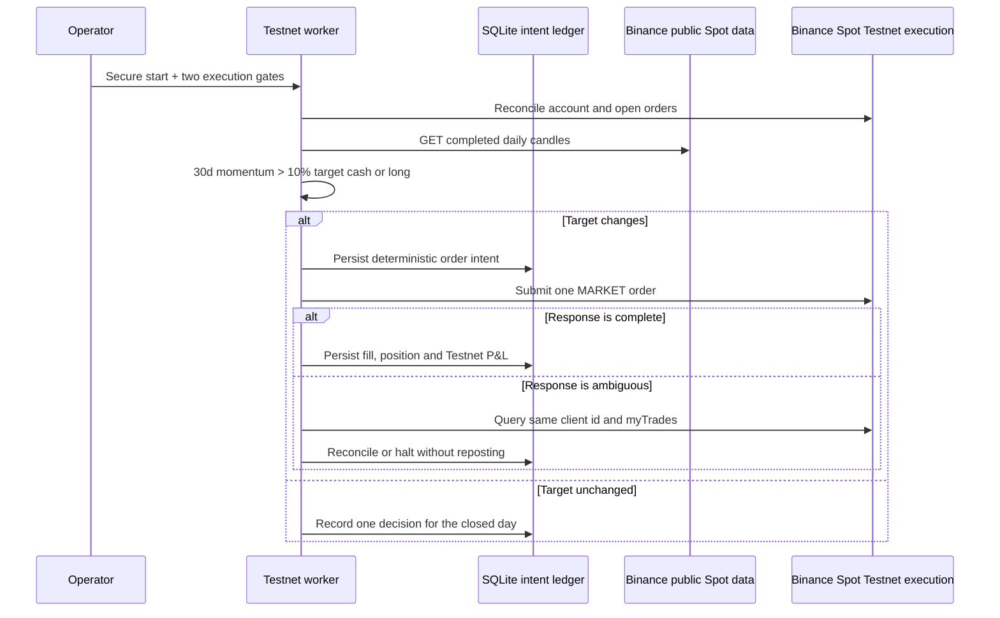

### Binance Testnet challenger öğrenme hattı

Testnet öğrenmesi yürütmeden ayrılmış iki katmanlı bir defter kullanır. Her
politika/model defteri, karar anında bilinen günlük nedensel özellikleri append-only
olarak saklar. Yeni tamamlanmış günlük mum geldiğinde yalnız bir önceki karar mumu ile
arasında tam `DAY_MS` varsa ileri günlük getiri hesaplanır ve örnek hash ile
mühürlenir. Kesinti veya veri boşluğu nedeniyle aralık daha uzunsa sonuç tek günlük
etiket gibi kullanılmaz; boşluk karantinaya kaydedilir.

İkinci kanıt tipi gerçek Testnet turudur. BUY dolumu açık turu maliyet ve miktarla
başlatır. Ancak eşleşen SELL dolumu pozisyonu tamamen kapattığında ve dolum/P&L
uzlaştırması kesinse tur kapanmış kanıt olur. Belirsiz, kısmi veya kayıp kaynak emir
eğitim kanıtı üretmez. Hâlihazırdaki `%10` policy'nin açık BTC pozisyonu aynı policy
tarafından çıkışa kadar yönetilir; öğrenme geçişi bu pozisyonu kapatmaz veya başka
modele mal etmez.

Her kaynak defterdeki kayıtlar kimlikleriyle ve idempotent biçimde o deftere özel
`state/<kaynak-defter-adı>-online-learning.sqlite3` içine alınır. Aggregate veritabanı
tam olarak bir `source_ledger_id` ve bir policy/model çiftine bağlanır; kaynak
defterde ikinci bir policy/model kaydı kabul edilmez ve farklı kimliklerin kanıtı
fiziksel olarak karıştırılmaz. Günlük etiketleri, kesin kapanmış turları,
dondurulmuş öğrenme koşularını ve son durumu bir arada tutar. Mühürlü etiket, boşluk,
tur, emeklilik ve hata kanıtı sonradan yeniden yazılmaz. Outbox çözüm bilgisi,
yenileme sağlığı ve registration yaşam döngüsü kontrollü mutable durumdur. İlk seçim
aday üretemezse en az 30 yeni etiket sonra yeniden denenebilir.
Bir aday dondurulduğunda seçim durur ve aynı sürüm kendi kesin dondurma-sonrası
kohortuyla izlenir. Dondurma sınırındaki tek örnek embargo olarak performanstan
çıkarılır. Dondurma sonrası süreklilik boşluğu adayı emekli eder ve yeni kesintisiz
bölüm ayrı bir eğitim yaşam döngüsü başlatır.

İlk seçim süresi, tamamlanmış ve kesintisiz Binance Spot geçmişinden üretilen tek
bir development-only seed ile kısaltılabilir. Builder ham CSV'yi, varsa kaynak
manifestini, mum ve etiket sınırlarını ve sıralı örnek kümesini SHA-256 özetleriyle
mühürler. Aggregate seed'i kendi kaynak defteri ile policy/model kimliğine bağlar.
Bu yol yalnız model fitine girdi sağlar; yürütme defterindeki emir, bakiye, pozisyon,
config veya credential durumuna yazmaz ve canlı validation kanıtı üretmez.

Seed kurulumu canlı yürütmeden ayrılmış, kapılı bir bakım geçişidir. Ham mutasyon CLI'sı
worker `running` veya `desired_running` iken reddedilir. Önerilen
`scripts/upgrade-binance-testnet-learning.ps1` akışı duruş süresini bütün salt-okunur
ve imzalı kontrollerden sonraya bırakır:

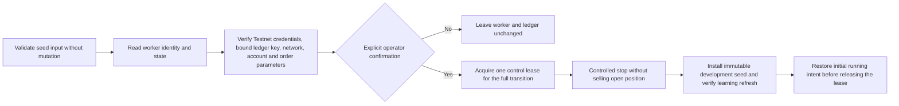

Stop açık pozisyonu kapatmaz; yalnız karar/emir döngüsünü kısa süreli durdurur. Kontrol
kilidi başlangıç durumu okunmadan önce alınır ve restore tamamlanana kadar tutulur.
Betik başlangıçta durmuş worker'ı durmuş bırakır; çalışan worker için bakım hata verse
bile çalışma niyetini kilidi bırakmadan önce geri yükler.
Companion manifest varsa interval oradan doğrulanır; yoksa betikte `-Interval 15m`
veya `-Interval 1d`, ham CLI'da `--interval 15m` veya `--interval 1d` açıkça
verilmelidir. `--validate-only` veri ve hash
mühürlerini hesaplar fakat defter, emir, bakiye, pozisyon veya config değiştirmez.

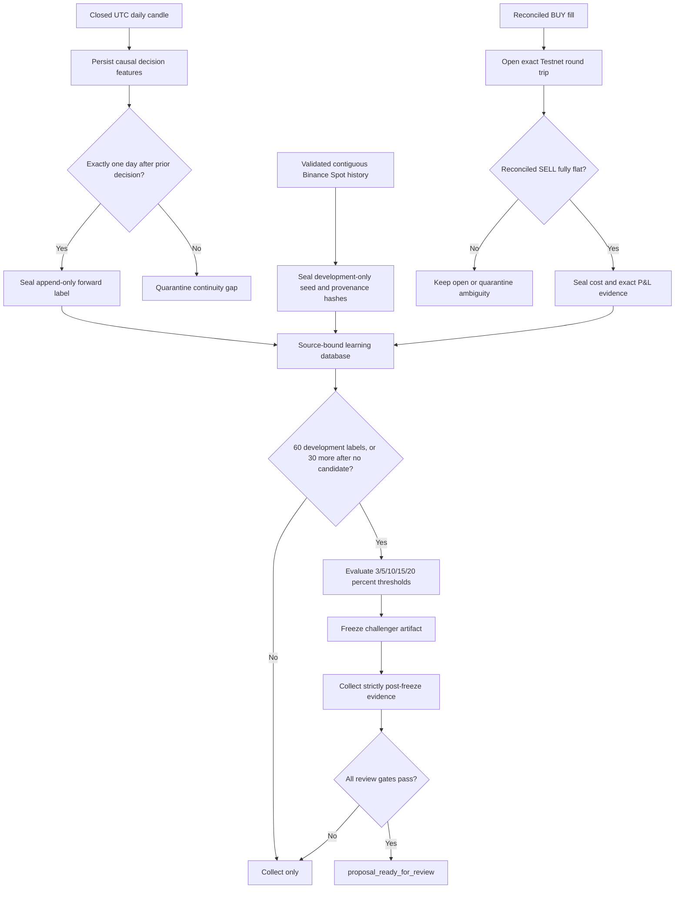

İlk fit, tarihsel seed ile canlı geliştirme girdilerinin toplamı olan
`cadence.development_labels` 60'a ulaştığında çalışır; aday çıkmazsa en az 30 yeni
geliştirme etiketinden sonra sabit `{%3, %5, %10, %15, %20}` eşiği yeniden
karşılaştırılabilir. Eğitimde görülen sonuçlar adayın performans ve üstünlük
metriklerine katılmaz. Üretilen artifact dondurulur, yeni fit durur ve bu
metrikler yalnız dondurma zamanından sonra oluşan dokunulmamış etiketlerde hesaplanır.
Günlük PF bileşik sermaye eğrisinin dönemsel P&L değerlerinden, gerçek tur PF'si ise
uzlaştırılmış USDT P&L değerlerinden hesaplanır.
Kapı kararları yuvarlanmamış `Decimal` metriklerle verilir; 12 basamaklı değerler
yalnız rapor gösterimidir ve sınırdaki sonucu yukarı yuvarlayarak geçiremez.

`proposal_ready_for_review` için etkin kesintisiz yaşam döngüsünde en az 200 canlı
OOS günlük etiket, en az 60 canlı dondurma-sonrası true-forward etiket ve challenger
geçişiyle eşleşen en az 8 kesin kapanmış Testnet turu gerekir. Tarihsel development
seed'i bu üç sayacı da artırmaz. Hem günlük ileri kohortun hem eşleşen gerçek turların maliyet sonrası
neti pozitif, PF'si en az `1,15`, azami düşüşü en fazla `%15` olmalı; challenger aynı
günlük örneklerde incumbent'ı geçmeli ve güvenlik ihlali olmamalıdır. Bu sonuç yürütme
yetkisi değildir. Öğrenme katmanı aktif config'i yazamaz, çalışan sürece hot-swap
yapamaz ve paper, real veya live bayraklarını açamaz. Operatör durumu
`python agent.py binance-testnet-learning-status` ile okuyabilir.
Durumda `evidence.historical_development_labels` yalnız seed örneklerini,
`evidence.development_labels` ve aynı değerdeki `cadence.development_labels` toplam
fit girdisini,
`evidence.finalized_daily_labels` mühürlü canlı etiket envanterini ve
`evidence.eligible_oos_daily_labels` etkin yaşam döngüsünün canlı OOS kısmını
gösterir. `evidence.true_forward_after_freeze_labels` etkin challenger'ın canlı
dondurma-sonrası holdout sayısıdır.
Durum komutu salt okunurdur. Günlük etiket, BUY-open, SELL-close ve epoch-karantina
olayları kalıcı outbox'ta eklenme sırasıyla oynatılır; ilk başarısız olay çözülmeden
sonraki olay uygulanmaz. Çözülmemiş outbox, başarısız son yenileme veya
`learning_revision != ingested_source_revision` koşulu eski hazır sonucunu
`stale_source_evidence`/fail-closed olarak geçersiz kılar. Worker yeni girişleri kanıt
outbox'ı çözülene kadar bekletir; mevcut long pozisyonun risk azaltan satışı engellenmez.
Adayın kaynak kaydına bağlanması önce kaynakta kalıcı bir bloklayıcı, sonra aggregate
pending state/event, kaynak apply ve aggregate acknowledge adımlarıyla ilerler. Her
ara durum yeniden oynatılabilir; pending varken durum hazır sayılamaz ve doğrudan
öğrenme yazımı yapılamaz. Öğrenici sürüm uyuşmazlığı otomatik yorumlanmaz; ayrı,
denetlenebilir bir arşiv/migrasyon yapılana kadar fail-closed kalır.

Mevcut `%10` incumbent'ın son 365 günlük Binance Spot tanısı `-%10,44`, PF `0,678`
ve kapanmış Testnet tur sayısı sıfırdır. Bu yüzden mimari, eğitim etkin olsa bile kâr
veya terfi sonucu bildirmez.

Binance'e özgü OI, funding, long/short oranı, order-book depth, short/kaldıraç,
reconciliation ve watchdog alanları saklı fakat pasiftir. Spot veriden türetilmiş
sahte değerlerle doldurulmaz.

## İleri gölge gözlem hattı

```mermaid
sequenceDiagram
    participant W as Worker
    participant E as v2_engine
    participant M as Frozen model
    participant S as v2_store
    participant D as SQLite

    W->>E: Latest fresh closed candle
    E-->>W: breakout/reentry candidates
    W->>M: Causal 17-feature vector
    M-->>W: version, probability, threshold, cash decision
    W->>W: Check quote timestamp, spread, target room
    W->>S: record_decisions
    S->>D: Insert immutable v2_prediction incl. accepted
    Note over W,D: Later closed candles arrive
    W->>S: replay_labels
    S->>E: Rebuild H8 outcome
    E-->>S: stop/target/vertical net return
    S->>D: Insert true_forward_shadow sample; resolve prediction
    Note over W,D: If a linked paper position actually closes
    W->>S: record_execution with actual paper P&L
    S->>D: Insert immutable v2_execution
```

`record_decisions` yalnız en yeni kapanmış mumu inceler; başlangıçta geçmiş adayları
ileri veri gibi doldurmaz. `v2_shadow_state` her `stream|spec|cost` alanında ankraj ve
son incelenen zamanı saklar. Aynı stratejinin çözülmemiş H8 olayı varken yenisi
kaydedilmez.

Tahmin satırındaki model sürümü, puan, eşik, `accepted`, özellik sürümü ve JSON
özellik vektörü değişmezdir. `accepted`; nakit/eşik kararının yanı sıra quote zaman
damgasının karar kapanışına eşit veya daha yeni olması, spread sınırı ve maliyet
sonrası hedef alanı kontrollerinin karar anındaki birleşik sonucudur. Sermaye
uygulaması aynı kontrolleri tekrar yapar. `replay_labels` yalnız sonucu oluşturan
mumlar kapanınca `v2_samples` satırını yazar. Böylece retraining eski bir tahmini
sonradan farklı modelle yeniden puanlamaz.

Uyku/kesinti sonrası istek 240 mumdan başlar ve en eski çözülmemiş prediction'ı
kapsamak için en çok 10.000 muma kadar büyür. Dolum mumunun hacmi sıfırsa işlem
gerçekleşmiş sayılmaz; prediction `no_fill_zero_volume` ile çözülür ve getiri örneği
yaratılmaz. Olay 10.000 mumluk saklama sınırının dışındaysa
`history_retention_exceeded_no_label`, istenen geçmiş sağlayıcı yanıtında yine yoksa
`replay_window_excluded_prediction_no_label` ile sansürlenir. Getiri uydurulmaz ve
aynı stratejinin çözülmemiş olay kilidi serbest kalır.

## Otomatik öğrenme ve terfi yenilemesi

Çözülen her standart H8 ileri etiketi dondurulmuş 17 özellik, maliyet sürümü ve
sonuçla yeniden eğitim için uygun hale gelir. Aynı H8 sonucunun pozitif/negatif sınıfı
ileri Brier kalibrasyonunda kullanılır. Worker, etiket çözümünden ve gerçek sanal
pozisyon çıkışından sonra güncel model sürümünün prequential terfi ölçümlerini yeniler.

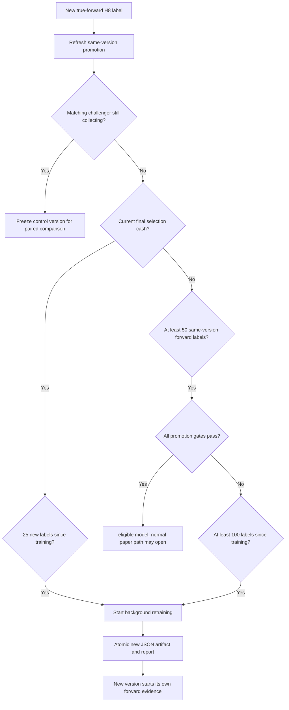

Arka plan eğitimi worker'ın quote ve koruyucu çıkış çevrimini bloke etmez. Yeniden
eğitim, tarihsel 200.000 mumla doğrulanmış ileri örnekleri birlikte kullanır. CSV'nin
yeni ucu daha önce toplanan forward olayları kapsarsa karar zamanı tarihsel son
zamana eşit veya daha eski olan forward satırlar ikinci kez eklenmez. Rapor ham,
eklenen ve örtüşme nedeniyle süzülen sayıları ayrı taşır. Eğitim süreci başlatılamazsa
worker yeniden deneme kontrolünü en fazla 15 dakikada bir yapar. Eşleşen challenger
`collecting` iken kontrolün 25-etiket retrain'i aynı gelecek olayların değişmeyen model
çiftiyle ölçülmesi için ertelenir. Toplama kotası sonuçlandığında bu özel freeze kalkar.
Yeni model sürümü eski sürümün ileri kanıtını devralmaz; her sürüm kendi promotion
kaydını toplar.

## Worker çevrimi

```mermaid
sequenceDiagram
    participant W as paper.worker
    participant B as Bitstamp
    participant V as paper_v2
    participant D as SQLite

    W->>D: Acquire single-process lock; read policy_epoch
    loop Approximately every 30 seconds
        W->>D: heartbeat and stop flag
        W->>B: Fetch 240..10,000 closed candles as needed
        W->>B: Fetch fresh bid/ask
        W->>V: tick quote, candles, time, budgets
        V->>D: Replay ready shadow labels
        V->>D: Refresh promotion / schedule retraining if due
        V->>D: Atomically record fresh control decision and matching challenger score
        V->>D: Mark and protect open virtual positions
        V->>D: Apply eligible model or one micro probe
        V->>D: Commit states, quote, success and events
    end
```

OHLC isteği başarısız olursa `rows=None` ile quote yolu çalışabilir; taze quote varsa
açık pozisyonun stop, hedef ve kesicileri yine kontrol edilir. Mum olmadan yeni giriş
yoktur. İkinci worker kilidi alamaz ve çıkar. Worker yokken `paper-start` ile politika
geçişinin yarışmaması için bu iki kontrol işlemi ayrıca `state/paper-control.lock`
üzerinde seri çalışır.

Challenger yalnız yeni bir kontrol prediction'ı gerçekten eklenirse puanlanır. Böylece
iki model aynı olay evrenini, karar zamanını, özellikleri ve quote anını görür; geçmiş
adaylar challenger tablosuna geriye dönük doldurulmaz.

## Sanal sermaye karar ağacı

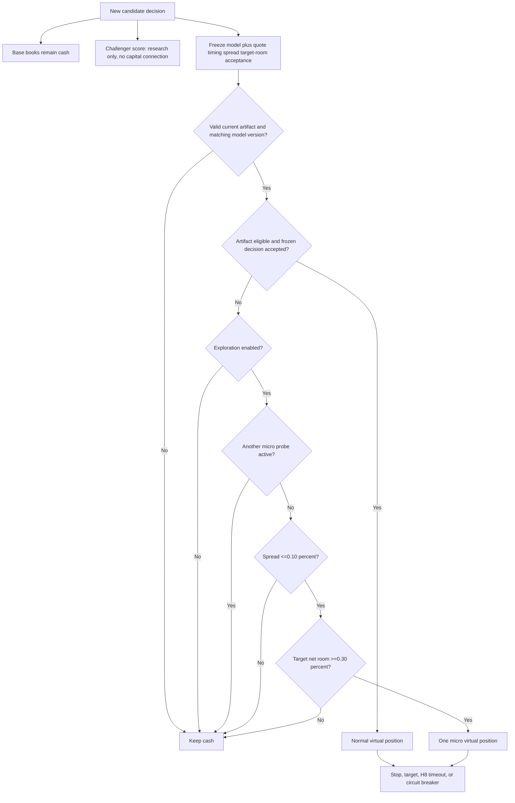

| Yol | Planlanan stop riski | Tahsis tavanı |
|---|---:|---:|
| Normal eligible model | %0,10 | %5 |
| Gölge mikro deneme | %0,01 | %0,5 |
| Challenger ayrık 100 USD hesabı | %0,20 | %10 |
| Temel defter | %0 | %0 |

`learned_breakout` ve `learned_reversion` aday hesaplarıdır. `learned_trend` v1
muhasebesi için kalır ve v2 sinyal eşlemesi yoktur. Aynı anda en fazla bir
`entry_mode=v2_micro_probe` bulunabilir.

Boyutlandırma ask referansına kayma ve komisyon ekler; stopta beklenen net tasfiye ile
alış nakit çıkışı arasındaki farkı planlanan kayıp sayar. Miktar hem risk bütçesinin
hem tahsis tavanının alt sınırıdır. Hedef maliyet sonrası en az %0,30 alan bırakmıyorsa
pozisyon açılmaz. Quote zaman damgası karar mumunun kapanışından eskiyse de giriş
engellenir.

Her defter bağımsız günlük ve zirve özkaynak taşır. UTC gün başlangıcından %2 kayıp
`daily_halt`, zirveden %8 düşüş `drawdown_halt` üretir. Açık pozisyon ilk taze quote'ta
kapanır. Toplam düşüş kesicisi otomatik sıfırlanmaz.

## Terfi mimarisi

Normal paper yolu yalnız bütün kontroller doğru olduğunda açılır:

```text
total_events >= 200
accepted_returns >= 30
positive_folds >= 4 of 5
profit_factor > 1.2
brier < baseline_brier
bootstrap_mean_lower_95 > 0
same-version true_forward_count >= 50
```

`true_forward` kaydı prediction yaratıldıktan sonra oluşmalı, model sürümü eşleşmeli,
etiket tahminden sonra kullanılabilir hale gelmeli ve maliyet/sinyal ad alanı aynı
olmalıdır. Standart H8 `v2_samples` sonucu ileri Brier hesabını ve yeniden eğitimi
besler. `accepted_returns`, profit factor ve bootstrap yalnız `accepted=true` olan ve
gerçekten açılıp kapanarak değişmez `v2_executions` satırı üreten paper işlemlerinden
gelir. `policy_migration_censored` çıkış bu kanıta girmez. Tarihsel örnek sayısı ileri
50 koşulunun yerine geçmez.

Güncel model `cash_selected=true`, `status=shadow`, `eligible=false` olduğundan normal
sermaye yolu kapalıdır. Gölge olmanın anlamı sistemin bozuk olması değil, kanıtın
normal risk yetkisi vermeye yetmemesidir.

Challenger için ana sermayeden bağımsız aday kapısı şudur:

```text
matched_future_events >= 200
would_accept >= 30
execution_gated_accepts >= 30
40bp_compounded_return > 0
40bp_profit_factor >= 1.2
bootstrap_mean_lower_95 > 0
forward_brier < frozen_training_baseline_brier
challenger_40bp_return > frozen_control_40bp_return
```

Bu kontroller aynı eğitim kesiminden sonra oluşan, H8 sonucu çözülmüş eşleşmiş olayları
kullanır. Güncel sayımlar `0 / 0 / 0` olduğundan durum `collecting`'dir. Bütün koşullar
geçilse bile çıktı yalnız `micro_probe_candidate=true`,
`capital_mutation=false` olur; normal kontrol modelinin terfi kapısını atlamaz.

## Kalıcı veri modeli

| Tablo/anahtar | İçerik |
|---|---|
| `state` | Worker bayrakları, policy epoch, son quote/başarı/hata ve altı portföy JSON'u |
| `events` | Başlatma, geçiş, gölge karar/etiket, eğitim, alım, satım ve engel olayları |
| `v2_predictions` | Dondurulmuş, sürümlü ileri tahminler ve çözüm durumu |
| `v2_samples` | Yeniden eğitim/kalibrasyon için standart H8 maliyet sonrası `true_forward_shadow` sonuçları |
| `v2_executions` | Prediction'a bağlı gerçek sanal giriş/çıkış, maliyet, P&L ve değişmez yürütme getirisi |
| `v2_challenger_models` | SHA ile doğrulanan, değişmez challenger artefaktı ve frozen kohort kimliği |
| `v2_challenger_scores` | Aynı event/model için frozen skor, eşik, yürütme filtresi ve özellik digest'i |
| `v2_challenger_portfolios` | Model başına ana hesaptan ayrı 100 USD mikro sanal hesap ve açık pozisyon |
| `v2_challenger_executions` | Challenger giriş/çıkış fiyatı, miktar, maliyet, P&L ve kapanış nedeni |
| `v3_paper_state` | V3 etkinlik bayrağı, 100 USD ayrık hesap ve açık pozisyon |
| `v3_paper_decisions` | Her taze kapanmış mumun kararı, nedeni ve gösterge anlık görüntüsü |
| `v3_paper_executions` | V3 giriş/çıkış fiyatı, maliyet, P&L ve kapanış nedeni |

Yeni V3.1 kararları ayrıca `v3_paper_decisions.feature_json` içinde karar anının
nedensel model özelliklerini saklar. `paper_v3.learning_samples()` yalnız kapanmış
yeni işlemleri bu dondurulmuş özellikler ve gerçekleşen net sonuçla birleştirir.
Bu hat risk almayı öğrenme verisine dönüştürür; model yeniden eğitimi ve gerçek
emir adaptörü ayrı terfi aşamalarıdır. Aşama kapıları `LIVE_TRADING_PLAN.md`
içinde tanımlıdır.
| `v2_shadow_state` | Stream/spec/cost ankrajı ve son incelenen karar |
| `policy_epoch` | Worker'ın kabul ettiği aktif politika |
| `policy_cutover_v2` | V2 başlangıç toplamı, kaynak politika ve quote |
| `archive_bollinger_v1_before_v2` | Geçiş öncesi altı portföyün tam kopyası |

`state/bollinger-v2-retrain.lock` arka plan eğitimini tekilleştirir;
`state/bollinger-v2-model-update.lock` eğitim ile promotion yenilemesinin aynı JSON
dosyasına eşzamanlı yazmasını engeller. Kilit yaşı iki saati aşarsa çökmüş süreç
kalıntısı olarak temizlenebilir. Eğitim çıktısı `state/bollinger-v2-retrain.log`
dosyasına gider.

`state/paper-control.lock`, `paper-start` ve `migrate-bollinger-v2` denetimlerini
worker'ın uzun ömürlü `state/paper.lock` kilidinden ayrı seri hale getirir. Geçiş,
control kilidinden sonra worker kilidini de almak zorundadır; çalışan worker varken
muhasebe taşınamaz.

Portföy kapanışı ile ona bağlı `v2_executions` satırı aynı SQLite transaction içinde
yazılır; yürütme kaydı başarısızsa portföy mutasyonu da geri alınır. Aktif v2 DB'sinde
portföy satırları kısmen veya tamamen kayıpsa kurtarma sermayesi sıfırdır. Yalnız bütün
ilgili anahtarların hiç bulunmadığı temiz ilk kurulum nominal sermaye yaratabilir;
bozuk boş JSON durum geçerli ilk kurulum sayılmaz.

V2 tablolarının birleşik benzersizliği stream, spec, maliyet, strateji ve karar
zamanının aynı olayı iki kez yazmasını önler. Şema yükseltmesi eksik `feature_version`,
`features` veya `resolution` sütunlarını ekleyebilir; v1 tablolarını silmez.

## Politika geçişi

```mermaid
sequenceDiagram
    participant U as Operator
    participant W as Worker lock
    participant B as Bitstamp quote
    participant D as SQLite

    U->>W: paper-stop and verify process_running=false
    U->>D: migrate-bollinger-v2
    D->>B: Request fresh quote
    D->>D: Archive v1 six-book state
    opt Legacy position is open
        D->>D: Close virtually as policy_migration_censored
    end
    D->>D: Preserve cash/equity; set capital modes
    D->>D: Write policy_cutover_v2 and policy_epoch
    U->>W: paper-start
    W->>D: First fresh candle becomes anchor
```

Geçiş bakiye sıfırlamaz. Açık v1 pozisyonun kapanışı finansal muhasebede kalır ancak
v2 ileri model örneği olmaz. V2 dönem P&L'ı `policy_cutover_v2.equity_usd` değerinden
başlar. Aynı politika için geçiş komutu tekrar çağrılırsa mevcut cutover döner.
Aktif v2 politikası eski `migrate-bollinger-15m` komutuyla v1'e düşürülemez. Boş bir
veritabanında `paper-start` da sermayeyi örtük kurmaz; önce açık v2 geçişi gerekir.

## Hata ve yeniden başlatma davranışı

| Durum | Davranış |
|---|---|
| Bitstamp OHLC hatası, quote geçerli | Yeni karar yok; açık pozisyonlar korunur |
| Quote geçersiz/eski | Tick hata kaydeder; işlem yapılmaz |
| Mum 120 saniyeden eski | Yeni aday sermaye yolu kapalı |
| Son mum hacmi sıfır | Yeni karar kaydı yok |
| Gerekli model yok/bozuk/eski sürüm | Yeni normal ve mikro giriş kapalı; model puanı kaydedilemez |
| Eşleşen challenger bozuk | Kontrol prediction, challenger skoru ve olası ayrık mikro giriş birlikte geri alınır; ana sermaye etkilenmez |
| Aktif v2 portföy satırı eksik/bozuk | Nominal bakiye üretilmez; sıfır sermayeyle fail-closed |
| Spread >%0,10 | Giriş engel olayı yazılır |
| Net hedef alanı <%0,30 | Giriş engel olayı yazılır |
| İkinci worker | Kilidi alamaz |
| Bilgisayar uyur | İşlem takibi durur; dönüşte güncel quote ve sınırlı etiket replay'i çalışır |
| Çözülmemiş olay 240 mumdan eski | Fetch penceresi gereken kadar, en çok 10.000 muma genişler |
| Gerekli olay geçmişi bulunamaz | Prediction `no-label` sansürlenir; strateji kilidi serbest kalır |
| Eski/tanınmayan politika | Worker uygun geçişi ister |

## Denetlenebilirlik

Model artefaktı, eğitim raporu ve veri dosyası ayrı SHA/digest kimlikleri taşır.
Tahmin olayı model sürümünü ve özellik vektörünü içerir; etiket olayı giriş/çıkış
referansını, net getiriyi, nedeni ve kullanılabilirlik zamanını içerir. Böylece şu
sorular SQLite ve JSON raporundan yanıtlanabilir:

- Model karar anında ne gördü?
- Hangi model sürümü ve eşik kullanıldı?
- Karar gerçekten ileri zamanda mı kaydedildi?
- Sonuç hangi stop/hedef/süre kuralıyla oluştu?
- Hangi ücret ve kayma sürümü kullanıldı?
- Bu örnek normal sermaye terfisine sayılabilir mi?
- Challenger ile kontrol aynı event ve frozen özellikleri mi gördü?
- Challenger ana sermayeyi değiştirmeden kendi ayrık hesabında hangi işlemleri açıp kapattı?

Bu mimari sahte pozitif sonuç üretmeyi önlemeye çalışır; gelecekte pozitif avantaj
bulunacağını garanti etmez.

## Doğrulanmış çalışma anlık görüntüsü

14 Eylül 2026'da 200.000 mumluk model yerleştirilip worker yeniden başlatılmıştır
(`process_running=true`); keşif açık ve açık pozisyon yoktur. V2 geçiş özkaynağı ile
güncel toplam özkaynak `999,9112799645061 USD`, v2 dönem P&L'ı `0 USD`'dir. Henüz
`v2_predictions`, `v2_samples` veya `v2_executions` satırı oluşmamıştır. Bu zaman
damgasında challenger `collecting`, eşleşmiş event/skor sayısı `0`dır. Ayrık mikro
hesap `100 USD`, açık/kapalı işlem `0 / 0`; ana sermaye yetkisi kapalıdır. Bu anlık görüntü kârlılık göstergesi değildir;
sonraki canlı durum `paper-status` ve `challenger-status` ile okunur. 17 Eylül
2026'daki son doğrulamada tam test paketi **367/367** geçmiştir.

Aynı gün V3 etkinleştirildikten sonraki doğrulamada ilk `adaptive_probe` işlemi
77.869,99 USD referanstan 15 USD maliyetle açıldı; stop 77.667,95 ve hedef
78.173,05 USD'dir. Bu V3 pozisyonu ana özkaynak toplamına ve V2 challenger hesabına
dahil değildir.

## Yöntem kaynakları

- [John Bollinger — resmî bant kuralları](https://www.bollingerbands.com/bollinger-band-rules)
- [Bitstamp — resmî API](https://www.bitstamp.net/api/)
- [Triple barrier ve meta-labeling](https://papers.ssrn.com/sol3/papers.cfm?abstract_id=3257419)
- [Purged çapraz doğrulama](https://papers.ssrn.com/sol3/papers.cfm?abstract_id=3257420)
- [Olasılık kalibrasyonu](https://doi.org/10.1145/1102351.1102430)
- [Zamansal model değerlendirmesi](https://doi.org/10.1007/s10994-020-05910-7)
- [Deflated Sharpe Ratio](https://www.davidhbailey.com/dhbpapers/deflated-sharpe.pdf)
- [Backtest overfitting olasılığı](https://www.davidhbailey.com/dhbpapers/backtest-prob.pdf)
